### Computer Architecture: Lab 2

#### Γενικά
Το παρόν repository δημιουργήθηκε για την παράδοση των αποτελεσμάτων του δευτέρου εργαστηρίου του μαθήματος Αρχιτεκτονική Υπολογιστών.  
Στον φάκελο _matlab\_scripts_ υπάρχουν όλα τα αρχεία κώδικα που γράφτηκαν ούτως ώστε να παραχθούν τα διαγράμματα που παρουσιάζονται στην συνέχεια της αναφοράς, τα οποία βρίσκονται στον φάκελο _images_.  
Δυστυχώς δε καταφέραμε ποτέ να τρέξουμε την προσομοίωση _spechmmer_ παρότι έγιναν οι εξής προσπάθειες:
* όλες οι δοκιμές πραγματοποιήθηκαν και από τα δύο μέλη της ομάδας, σε διαφορετικούς υπολογιστές ο καθένας.
* Από τις πρώτες μέρες αφότου αναρτήθηκε η εκφώνηση του δευτέρου εργαστηρίου επικοινωνήσαμε μέσω email ούτως ώστε να βρεθεί λύση στο πρόβλημα.
* Σε απάντηση του αρχικού μας email μας αποστείλατε ένα καινούριο zip file της συγκεκριμένης προσομοίωσης, το οποίο επίσης δε καταφέραμε να το κάνουμε λειτουργικό.
* Σε συνέχεια των προσπαθειών φέραμε το λάπτοπ του ενός μέλους της ομάδας στο εργαστήριο μήπως και μπορέσετε να βρείτε κάποια λύση, όπου και μας προτείνατε να δοκιμάσουμε να χρησιμοποιήσουμε διαφορετικό compiler version. Ακόμη όμως και μετά την αλλαγή αυτή δεν εκτελέστηκε ποτέ η προσομοίωση.
* Τέλος αξίζει να αναφερθεί πως αναζητήσαμε πιθανές λύσεις στο διαδίκτυο και στο github αλλά δε βρήκαμε κάτι βοηθητικό για την περίπτωσή μας.
* Όλες οι υπολοιπές προσομοιώσεις πραγματοποιήθηκαν κανονικά και προέκυψαν οι μετρήσεις που ακολουθούν στην αναφορά.

#### Μέρος 1
1) Για να βρούμε τις ζητούμενες παραμέτρους, χρησιμοποιήσαμε τα αρχεία stats.txt που δημιουργήθηκαν κατά την εκτέλεση των προσομοιώσεων και συγκεκριμένα τις εξής γραμμές:
1. _sim_insts_ για τον αριθμό των εντολών που προσομοιώθηκαν
2. _system.cpu.committedInsts_ για τον αριθμό των εντολών που καταχωρήθηκαν
3. _system.cpu.dcache.replacements_ για το πλήθος των block replacements της L1 Data Cache.
4. _system.l2.overall_accesses::total_ για το πλήθος των προσβάσεων στην L2 cache.
5. _sim_seconds_ για τον χρόνο που διήρκησε η προσομοίωση στον επεξεργαστή της προσομοίωσης
6. _system.cpu.cpi_ για το CPI της προσομοίωσης
7. _system.cpu.dcache.overall_miss_rate::total_ για το miss rate της L1 Data Cache.
8. _system.cpu.icache.overall_miss_rate::total_ για το miss rate της L1 Instruction Cache.
9. _system.l2.overall_miss_rate::total_ για το miss rate της L2 Cache.

Σχηματίζουμε λοιπόν τον παρακάτω πίνακα με βάση τα αποτελέσματα των προσομοιώσεων: (πίνακας 1)

| |SPECBZIP|SPECMCF|SPECSJENG|SPECLIBM|
|:-----------:|:---------:|:----------:|:-----:|:-----:|
|simulated instructions|100000000|100000000|100000000|100000000|
|committed instructions|100000000|100000000|100000000|100000000|
|L1 data cache replacements|681759|55092|5262346|1486606|
|L2 accesses|683562|190604|5264008|1488197|
|simulation seconds|0.083664|0.058458|0.513833|0.174763|
|CPI|1.673271|1.169160|10.276660|3.495270|
|L1 data cache miss rate|0.014311|0.002124|0.121831|0.060971|
|L1 instruction cache miss rate|0.000076|0.004844|0.000015|0.000094|
|L2 miss rate|0.295248|0.209015|0.999978|0.999943|

Α) Σύμφωνα με τα στοιχεία του παραπάνω πίνακα, βρήκαμε ίδιο αριθμό committed και simulated instructions σε όλες τις προσομοιώσεις.  
Β) Στον προηγούμενο πίνακα φαίνεται το πλήθος των αντικαταστάσεων στην L1 data cache, όπου έχει τη μεγαλύτερη τιμή στο benchmark specsjeng.
Γ) Ο αριθμός των προσβάσεων στην L2 cache θα μπορούσε να υπολογιστεί και από την πρόσθεση των L2 overall hits και L2 overall misses: L2 accesses = L2 overall hits + L2 overall misses.

2) Για τα παραπάνω benchmarks δημιουργήθηκαν γραφήματα για:  
i) τον χρόνο εκτέλεσης
ii) CPI
iii) miss rates

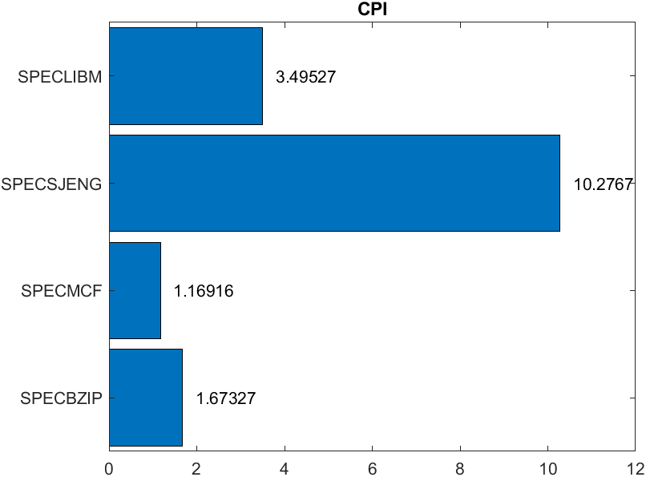
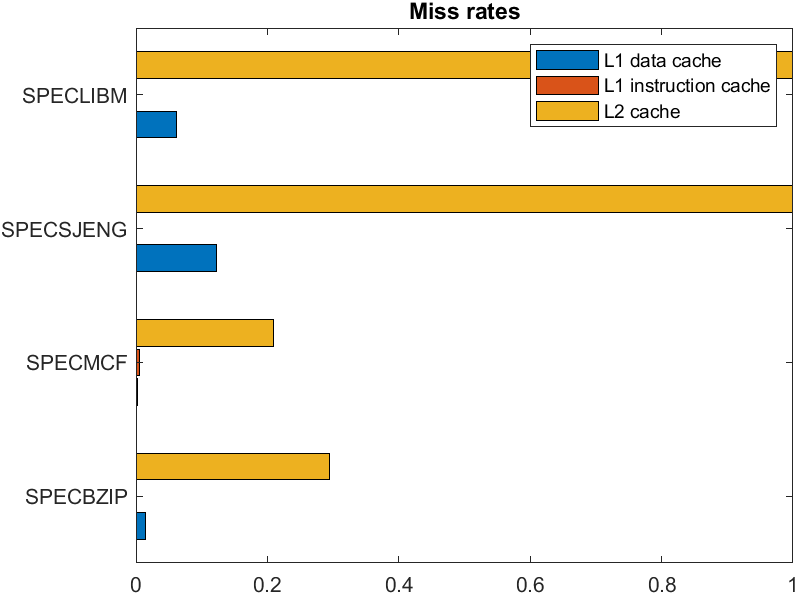

3) Επιλέξαμε να τρέξουμε το benchmark specmcf με την επιπλέον παράμετρο --cpu-clock=1.5GHz. Έπειτα πήγαμε στα αρχεία stats.txt για την αρχική αλλά και για την αλλαγμένη προσομοίωση και πήραμε τα αποτελέσματα που φαίνονται στον επόμενο πίνακα για τις τιμές των system.clk_domain.clock και cpu_cluster.clk_domain.clock:

|	|CPU FREQ:DEFAULT|CPU FREQ:1.5GHz|
|:----:|:----:|:-----:|
|SYSTEM CLOCK|1000|1000|
|CPU CLOCK|500|667|

>Οι τιμές στον παραπάνω πίνακα είναι μετρημένες σε ticks per clock period. (1 tick = 1 picosecond)

Η συχνότητα ρολογιού της CPU χρονίζει όλα τα συστήματα στο εσωτερικό του επεξεργαστή, ενώ η συχνότητα του συστήματος χρονίζει τα περιφερειακά συστήματα όπως η μνήμη DRAM.

Πιο συγκεκριμένα, αν αναζητήσουμε στο αρχείο config.ini τα tags, παρατηρούμε ότι το καθένα επηρεάζει τα παρακάτω στοιχεία:  
[system.clk_domain]  
1)[system.dvfs_handler]  
2)[system.mem_ctrls]  
3)[system.mem_ctrls.dram]  
4)[system.membus]  
[system.cpu_clk_domain]  
1)[system.cpu]  
2)[system.cpu.dcache]  
3)[system.cpu.icache]  
4)[system.cpu.l2] 

Αν ανατρέξουμε στο αντίστοιχο config.json αρχείο για κάθε περίπτωση, θα διαπιστώσουμε ότι το system.clk_domain.clock ισούται με 1000 ticks (1 tick = 1 picosecond) και στις δύο περιπτώσεις αφού αυτή είναι η default τιμή του. Αντίθετα, το system.cpu.clk_domain.clock μεταβάλλεται από 500 σε 667. Αυτό είναι λογικό αφού η συχνότητα μειώθηκε κατά 500Hz. 

Δηλαδή, τα 500 ticks αντιστοιχούν σε περίοδο 500 picoseconds, δηλαδή σε συχνότητα ίση με 2 GHz ενώ τα 667 ticks αντιστοιχούν σε περίοδο 667 picoseconds, δηλαδή σε συχνότητα 1/667*10^12 = 1.499 GHZ = 1.5 GHz

Αν προσθέσουμε άλλον έναν επεξεργαστή, η συχνότητα χρονισμού του θα είναι η συχνότητα της CPU (CPU Frequency)  δηλαδή το system.cpu_clk_domain.clock.

Όπως είναι λογικό, η μείωση της συχνότητας του ρολογιού έχει ως αποτέλεσμα την αύξηση του χρόνου εκτέλεσης. Θα περίμενε κανείς πως η μείωση της συχνότητας στα ¾ της αρχικής, θα επιφέρει ανάλογη αύξηση του χρόνου εκτέλεσης. Παρ' όλα αυτά, αυτό δεν συμβαίνει στην πράξη σύμφωνα με τον παρακάτω πίνακα.

Προσομοιώνοντας κάθε benchmark με τη καινούρια συχνότητα προκύπτει ο παρακάτω πίνακας με τους χρόνους εκτέλεσης πριν και μετά την αλλαγή:
| |SPECBZIP|SPECMCF|SPECSJENG|SPECLIBM|
|:-----------:|:---------:|:----------:|:-----:|:-----:|
|CPU FREQ:DEFAULT|0.0838|0.0555|0.5138|0.1748|
|CPU FREQ:1.5GHz|0.1096|0.0733|0.5821|0.2051|
|PERCENTAGE OF TIME'S INCREASE|30.79%|32.07%|13.29%|17.33%|

Φαίνεται ότι κάποια από τα benchmarks έχουν σχεδόν τέλειο scaling στο χρόνο εκτέλεσης αλλά κάποια άλλα, όπως τα speclibm και specsjeng δεν έχουν τέλειο scaling. Αυτό συμβαίνει διότι τα συγκεκριμένα benchmarks έχουν αρκετά μεγάλο Level 2 Cache Miss Rate, συνεπώς γίνονται αρκετές προσπελάσεις στην DRAM η οποία χρονίζεται με το ρολόι του συστήματος, του οποίου η τιμή δεν αλλάζει.  
Αντίθετα, τα άλλα δυο benchmark έχουν σχεδόν τέλειο scaling, διότι τα DRAM overall accesses είναι αισθητά λιγότερα, συνεπώς η μείωση της συχνότητας κατά ¼ έχει ως αποτέλεσμα σχεδόν την αύξηση σχεδόν κατά ¼ του χρόνου εκτέλεσης.

#### Μέρος 2
Για να γίνουν τα παρακάτω διαγράμματα έγιναν πολλές προσομοιώσεις αλλάζοντας κάθε φορά μια παράμετρο (σύνολο 6 παράμετροι) και κρατώντας τις υπόλοιπες σταθερές, για κάθε ένα από τα 5 διαφορετικά benchmarks. Οι τιμές που δοκιμάσαμε ήταν οι εξής:
L1 data cache size = 32kB, 64kB, 128kB, 256kB
L1 instruction cache size = 32kB, 64kB, 128kB, 256kB
L2 cache size = 256kB, 512kB, 1MB, 2MB, 4MB
L1 data cache associativity = 1, 2, 4
L1 instruction cache associativity = 1, 2, 4
L2 cache associativity = 1, 2, 4

1. Για το benchmark **specbzip** προέκυψαν τα εξής διαγράμματα:

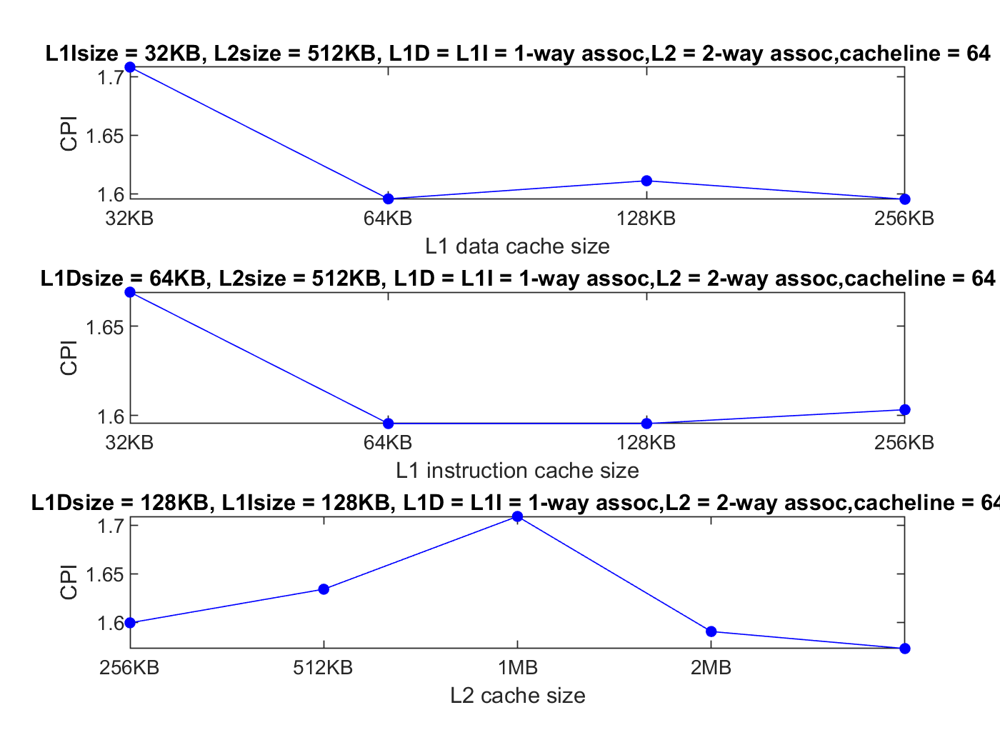
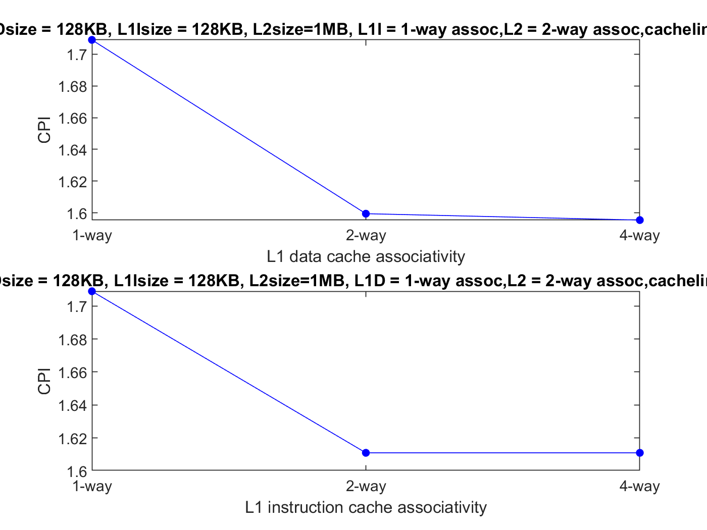
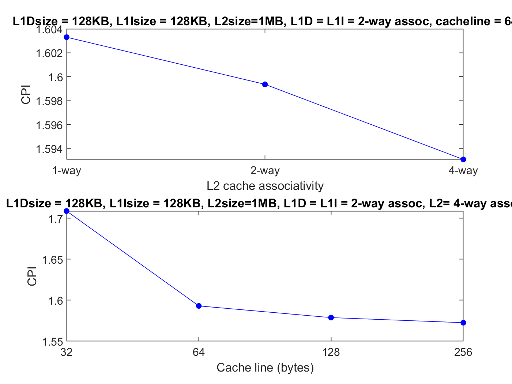

2. Για το benchmark **specmcf**:

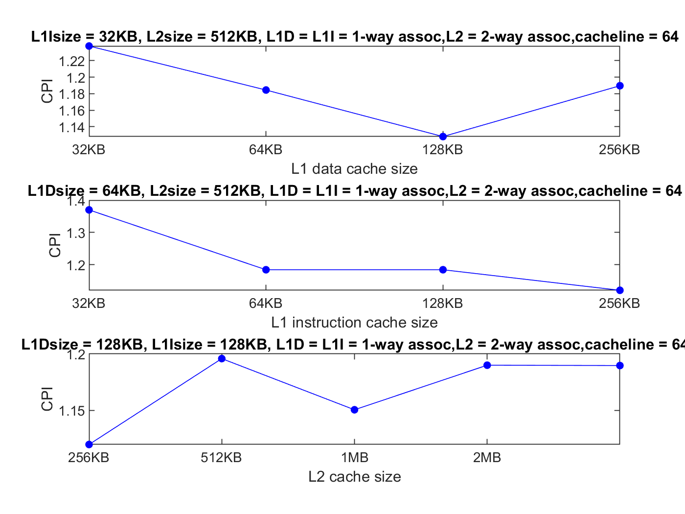
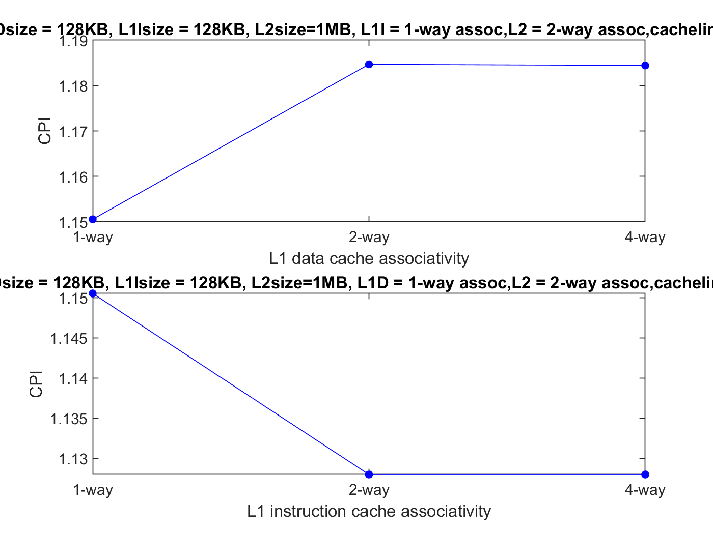
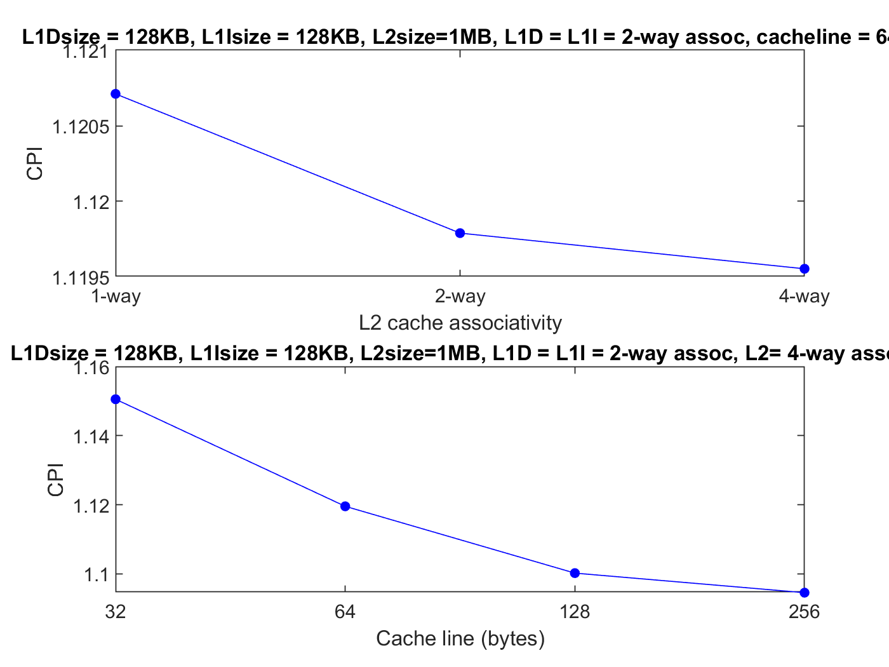

3. Για το benchmark **speclibm** προέκυψαν τα εξής διαγράμματα:

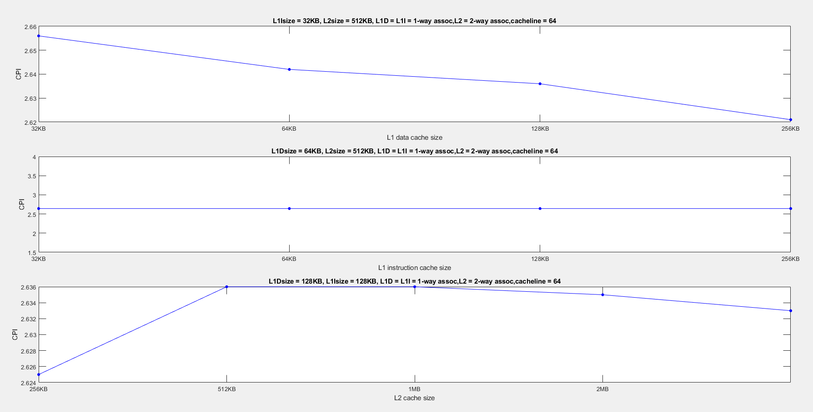
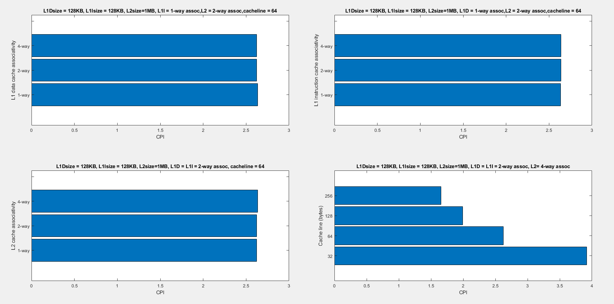

4. Για το benchmark **specsjeng**:

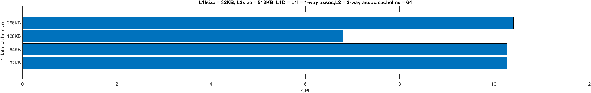
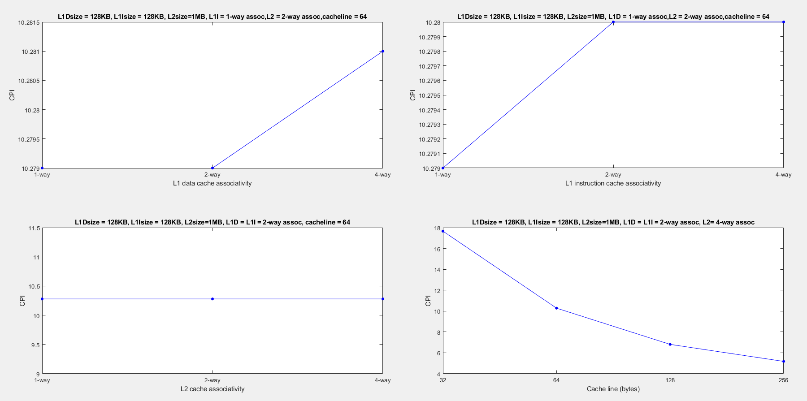

Από τα παραπάνω γραφήματα παρατηρούμε ότι όταν αυξάνονται τα miss rates τόσο στην L1 cache όσο και στην L2, αυξάνεται και το CPI. Αυτό είναι λογικό εφόσον το CPI εξαρτάται από τα miss rates των μνημών. Επιπλέον παρατηρούμε πως τα benchmarks με τους μεγαλύτερους χρόνους, δηλαδή τα sjeng και libm είναι αυτά που έχουν και τα μεγαλύτερα miss rates, το οποίο είναι αναμενόμενο, καθώς οποιοδήποτε miss συμβαίνει οδηγεί σε καθυστερήσεις στη ροή του προγράμματος, μέχρι να έρθουν τα ζητούμενα δεδομένα από το επόμενο επίπεδο στην ιεραρχία της μνήμης. Επομένως, είναι τα L2 misses που κοστίζουν πολύ στο χρόνο εκτέλεσης και στο CPI, γιατί σε αυτή τη περίπτωση τα δεδομένα ζητούνται από τη κύρια μνήμη.

#### Μέρος 3
Προσπαθήσαμε σε αυτό το σημείο να υπολογίσουμε μια συνάρτηση κόστους για τη κάθε δυνατή επιλογή.  
* Η L1 cache έχει διαφορετικές απαιτήσεις συγκριτικά με την L2 cache. Πιο συγκεκριμένα, η L1 cache θέλουμε να είναι πολύ γρήγορη και περιορισμένη σε φυσικό χώρο. Η L2 cache από την άλλη μπορεί να καταλαμβάνει μεγαλύτερο χώρο, οπότε έχει και μεγαλύτερη χωρητικότητα, ωστόσο οι απαιτήσεις σε ταχύτητα προσπέλασης είναι μικρότερες.
* Για τους παραπάνω λόγους, η L1 cache κοστίζει περισσότερο για την ίδια χωρητικότητα συγκριτικά με τη L2 cache. Θα θεωρήσουμε πως για την ίδια χωρητικότητα, η L1 cache έχει κόστος πολλαπλασιασμένο με έναν συντελεστή που θα έχει την τιμή 2,5.
* Καθώς μεγαλώνουμε τη χωρητικότητα της μνήμης, αυτομάτως αυξάνεται και το κόστος υλοποίησης της. Αυτό συμβαίνει διότι χρησιμοποιούνται στη κατασκευή περισσότερα τρανζίστορ και γενικότερα υπάρχει αύξηση στο υλικό. Γίνεται η θεώρηση πως το κόστος αυξάνεται αναλογικά με την άυξηση της χωρητικότητας, δηλαδή μία μνήμη 64kB θα κοστίζει το διπλάσιο μίας μνήμης με τη μισή χωρητικότητα.
* Όταν χρησιμοποιείται μεγαλύτερο associativity το κόστος θα πρέπει να αυξάνεται καθώς χρησιμοποιούνται περισσότεροι πολυπλέκτες και πιο σύνθετα κυκλώματα, απαραίτητα για να λειτουργεί σωστά η μνήμη. Ωστόσο εδώ θα θεωρήσουμε πως σε κάθε διπλασιασμό του associativity δεν συμβαίνει διπλασιασμός του κόστους, αλλά θα θεωρήσουμε πολλαπλασιασμό του κόστους με συντελεστή 1,4. Για τον λόγο αυτό χρησιμοποιούμε τους λογαριθμικούς εκθέτες στην μαθηματική έκφραση του κόστους.
*  Για το μέγεθος της cache line θα θεωρήσουμε πως η αλλαγή του δεν επηρεάζει σημαντικά το κόστος της υλοποίησης, συνεπώς δε συμπεριλαμβάνεται στην εξίσωση για τον υπολογισμό του κόστους.
* Συνοψίζοντας τις παραπάνω παρατηρήσεις/προτάσεις, ορίζουμε ως κ τη στοιχειώδη μονάδα κόστους. Τότε, το συνολικό κόστος μιας υλοποίησης  θα δίνεται από τον παρακάτω τύπο:

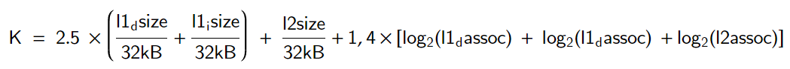

οι αναφερόμενες μεταβλητές μπορούν να πάρουν τιμές από τα ακόλουθα σύνολα:

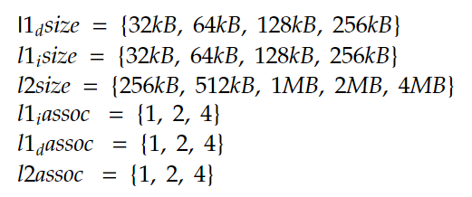

Σχηματίσαμε το παρακάτω διάγραμμα CPI-κόστους για όλες τις προσομοιώσεις που εκτελέσαμε ώστε να πάρουμε τα αποτελέσματα για το μέρος Β:

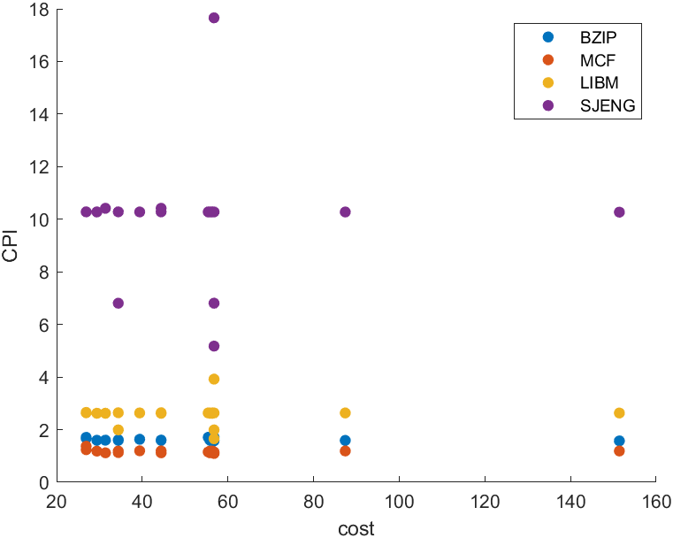

Εφόσον έχουμε τη συνάρτηση κόστους θα προσπαθήσουμε να επιλέξουμε το κατάλληλο configuration με βάση και τα προηγούμενα γραφήματα. Σχηματίζουμε τον παρακάτω πίνακα, όπου στην προτελευταία γραμμή υπολογίζουμε το κόστος των επιλογών και στην τελευταία γραμμή είναι το CPI που προκύπτει:

| |SPECBZIP|SPECMCF|SPECSJENG|SPECLIBM|
|:-----------:|:---------:|:----------:|:-----:|:-----:|
|L1 data cache size|64kB|128kB|128kB|32 kB|
|L1 instruction cache size|64kB|64kB|64kB|64 kB|
|L2 cache size|512kB|256kB|512kB|256 kB|
|L1 data cache associativity|2|1|1|2|
|L1 instruction cache associativity|2|2|1|1|
|L2 cache associativity|4|2|1|1|
|cache line size|128|128|256|256|
|cost|22.2|26.8|34|18.9|
|CPI|1.746|1.103|5.181|1.655|

#### Πηγές
[Cache memory cost](https://superuser.com/questions/808830/why-is-cache-memory-so-expensive.com)  
[Cache memory sizes](https://stackoverflow.com/questions/4666728/why-is-the-size-of-l1-cache-smaller-than-that-of-the-l2-cache-in-most-of-the-pro.com)  
[Set associative cache](https://www.sciencedirect.com/topics/computer-science/set-associative-cache)  

#### Κριτική
Το δεύτερο εργαστήριο του μαθήματος μας φάνηκε ιδιαίτερα απαιτητικό. Για να είναι η εργασία ολοκληρωμένη έπρεπε να πραγματοποιηθούν πάρα πολλές προσομοιώσεις. Επίσης ο χρόνος εκτέλεσης ήταν αυξημένος λόγω παλιού hardware, γεγονός που μας οδήγησε να χάσουμε την ουσία των προσομοιώσεων και της εργασίας γενικότερα. Πιστεύουμε εν ολίγοις πως ο χρόνος που απαιτήθηκε για το δεύτερο εργαστήριο ήταν δυσανάλογα μεγάλος για τις απαιτήσεις του μαθήματος.

