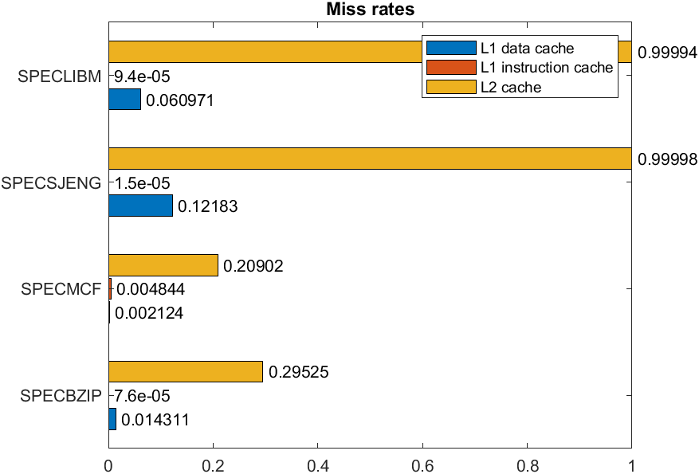
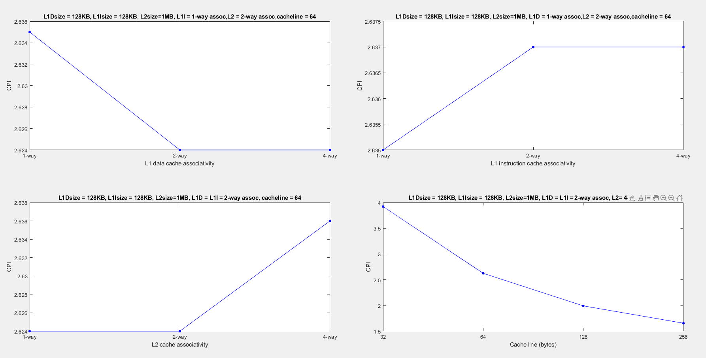

### Computer Architecture: Lab 2

#### Μέρος 1
1) Για να βρούμε τις ζητούμενες παραμέτρους, χρησιμοποιήσαμε τα αρχεία stats.txt που δημιουργήθηκαν κατά την εκτέλεση των προσομοιώσεων και συγκεκριμένα τις εξής γραμμές:
1. sim_insts για τον αριθμό των εντολών που προσομοιώθηκαν
2. system.cpu.committedInsts για τον αριθμό των εντολών που καταχωρήθηκαν
3. system.cpu.dcache.replacements για το πλήθος των block replacements της L1 Data Cache.
4. system.l2.overall_accesses::total για το πλήθος των προσβάσεων στην L2 cache.
5. sim_seconds για τον χρόνο που διήρκησε η προσομοίωση στον επεξεργαστή της προσομοίωσης
6. system.cpu.cpi για το CPI της προσομοίωσης
7. system.cpu.dcache.overall_miss_rate::total για το miss rate της L1 Data Cache.
8. system.cpu.icache.overall_miss_rate::total για το miss rate της L1 Instruction Cache.
9. system.l2.overall_miss_rate::total για το miss rate της L2 Cache.

Σχηματίζουμε λοιπόν τον παρακάτω πίνακα με βάση τα αποτελέσματα των προσομοιώσεων: (πίνακας 1)

| |SPECBZIP|SPECMCF|SPECSJENG|SPECLIBM|
|:-----------:|:---------:|:----------:|:-----:|:-----:|
|simulated instructions|100000000|100000000|100000000|100000000|
|committed instructions|100000000|100000000|100000000|100000000|
|L1 data cache replacements|681759|55092|5262346|1486606|
|L2 accesses|683562|190604|5264008|1488197|
|simulation seconds|0.083664|0.058458|0.513833|0.174763|
|CPI|1.673271|1.169160|10.276660|3.495270|
|L1 data cache miss rate|0.014311|0.002124|0.121831|0.060971|
|L1 instruction cache miss rate|0.000076|0.004844|0.000015|0.000094|
|L2 miss rate|0.295248|0.209015|0.999978|0.999943|

Α) Σύμφωνα με τα στοιχεία του παραπάνω πίνακα, βρήκαμε ίδιο αριθμό committed και simulated instructions.

Γ) Ο αριθμός των προσβάσεων στην L2 cache θα μπορούσε να υπολογιστεί και από την πρόσθεση των icache misses και dcache misses, δηλαδή τον αριθμό των συνολικών misses στην L1 cache.

2) Για τα παραπάνω benchmarks δημιουργήθηκαν γραφήματα για:  
i) τον χρόνο εκτέλεσης
ii) CPI
iii) miss rates

3) Επιλέξαμε να τρέξουμε το benchmark specmcf με την επιπλέον παράμετρο --cpu-clock=1.5GHz. Έπειτα πήγαμε στα αρχεία stats.txt για την αρχική αλλά και για την αλλαγμένη προσομοίωση και πήραμε τα αποτελέσματα που φαίνονται στον επόμενο πίνακα για τις τιμές των system.clk_domain.clock και cpu_cluster.clk_domain.clock:

|	|CPU FREQ:DEFAULT|CPU FREQ:1.5GHz|
|:----:|:----:|:-----:|
|SYSTEM CLOCK|1000|1000|
|CPU CLOCK|500|667|

>Οι τιμές στον παραπάνω πίνακα είναι μετρημένες σε ticks per clock period. (1 tick = 1ms)

Εύκολα γίνεται αντιληπτό πως η παραπάνω παράμετρος επηρεάζει μόνο το cpu clock. Η ταχύτητα του ρολογιού του επεξεργαστή αυξήθηκε κατα 33.3%.
Επίσης, ο χρόνος της πρώτης προσομοίωσης ήτανε 0.058458 seconds ενώ της δεύτερης, μετά την αλλαγή στο ρολόι του επεξεργαστή, έγινε 0.077242 seconds, το οποίο είναι αύξηση κατά 32.1%.

#### Μέρος 2
Για να γίνουν τα παρακάτω διαγράμματα έγιναν πολλές προσομοιώσεις αλλάζοντας κάθε φορά μια παράμετρο και κρατώντας τις υπόλοιπες σταθερές, για κάθε ένα από τα 5 διαφορετικά benchmarks. 

1. Για το benchmark speclibm προέκυψαν τα εξής διαγράμματα:

2. Για το benchmark specsjeng:

