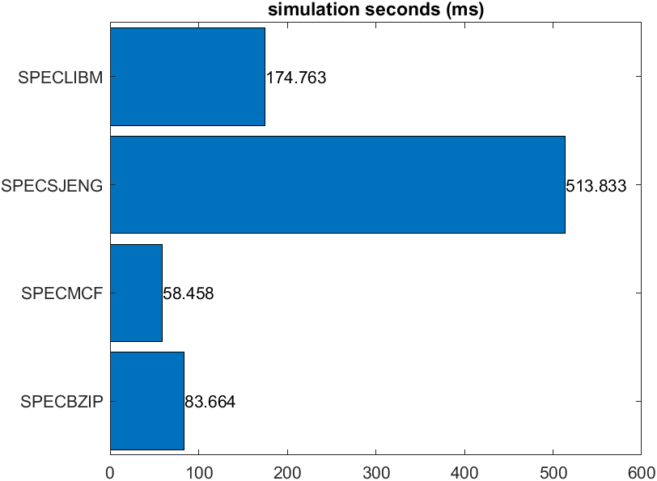
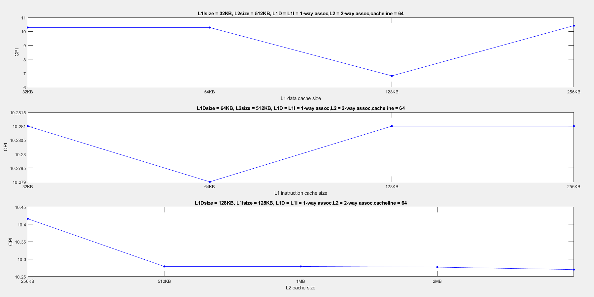
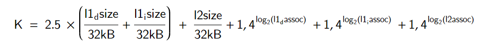

# Computer Architecture: Lab 2
## Contributors
1. Full Name: Konstantinos Gerogiannis  
   Email: kostas.gerogiannis04@gmail.com  
   Github: [kostaGRG](https://github.com/kostaGRG/)  
2. Full Name: Katerina Vosniadou
   Email: katerinavosn@gmail.com  
   Github: [katerinavos](https://github.com/katerinavos)
   
## Intro
This project is created for the university class named Computer Architecture at Aristotle University of Thessaloniki (AUTh). It's the second out of three repositories referenced on the same class.

## General
This repository was created for the submission of the results of the second laboratory assignment in the Computer Architecture course. In the _matlab_scripts_ folder, you can find all the code files that were written to generate the diagrams presented in the report, which are located in the _images_ folder. Unfortunately, we were never able to run the spechmmer simulation despite the following efforts:

* All tests were conducted by both members of the team on different computers.
* From the first days after the assignment was posted, we contacted you via email to find a solution to the problem.
* In response to our initial email, you sent us a new zip file of the simulation, which also we couldn't make functional.
* Continuing our efforts, we brought one team member's laptop to the lab in the hope that you could find a solution. You suggested trying a different compiler version, but even after this change, the simulation never executed.
* Finally, it's worth mentioning that we searched for possible solutions on the internet and on GitHub but couldn't find anything helpful for our case.
* All other simulations were carried out successfully, and the measurements presented in the report are the results of those simulations.

## Part A
1) To find the requested parameters, we used the stats.txt files generated during the simulations, specifically the following lines:
1. _sim_insts_ for the number of simulated instructions.
2. _system.cpu.committedInsts_ for the number of committed instructions.
3. _system.cpu.dcache.replacements_ for the number of block replacements in the L1 Data Cache.
4. _system.l2.overall_accesses::total_ for the total number of accesses to the L2 cache.
5. _sim_seconds_ for the simulation time on the simulated processor.
6. _system.cpu.cpi_ for the CPI (Cycles Per Instruction) of the simulation.
7. _system.cpu.dcache.overall_miss_rate::total_ for the miss rate of the L1 Data Cache.
8. _system.cpu.icache.overall_miss_rate::total_ for the miss rate of the L1 Instruction Cache.
9. _system.l2.overall_miss_rate::total_ for the miss rate of the L2 Cache.
    
We then create the following table based on the results of the simulations (Table 1):

| |SPECBZIP|SPECMCF|SPECSJENG|SPECLIBM|
|:-----------:|:---------:|:----------:|:-----:|:-----:|
|simulated instructions|100000000|100000000|100000000|100000000|
|committed instructions|100000000|100000000|100000000|100000000|
|L1 data cache replacements|681759|55092|5262346|1486606|
|L2 accesses|683562|190604|5264008|1488197|
|simulation seconds|0.083664|0.058458|0.513833|0.174763|
|CPI|1.673271|1.169160|10.276660|3.495270|
|L1 data cache miss rate|0.014311|0.002124|0.121831|0.060971|
|L1 instruction cache miss rate|0.000076|0.004844|0.000015|0.000094|
|L2 miss rate|0.295248|0.209015|0.999978|0.999943|

A) According to the data in the table above, we found the same number of committed and simulated instructions in all simulations.  
B) In the previous table, the number of replacements in the L1 data cache is shown, with the highest value in the specsjeng benchmark.  
C) The number of accesses to the L2 cache could also be calculated by adding L2 overall hits and L2 overall misses: L2 accesses = L2 overall hits + L2 overall misses.  

2) Graphs were created for the above benchmarks for:  
i) execution time  
ii) CPI (Cycles Per Instruction)  
iii) miss rates

4) We chose to run the specmcf benchmark with the additional parameter --cpu-clock=1.5GHz. Then we went to the stats.txt files for both the original and modified simulations and obtained the results shown in the following table for the values of system.clk_domain.clock and cpu_cluster.clk_domain.clock:

|	|CPU FREQ:DEFAULT|CPU FREQ:1.5GHz|
|:----:|:----:|:-----:|
|SYSTEM CLOCK|1000|1000|
|CPU CLOCK|500|667|

>The above values are measured as ticks per clock period. (1 tick = 1 picosecond)

The CPU clock frequency synchronizes all the systems within the processor, while the system clock frequency synchronizes peripheral systems such as DRAM memory.

More specifically, if we look for the tags in the config.ini file, we observe that each one affects the following elements:
[system.clk_domain]  
1)[system.dvfs_handler]  
2)[system.mem_ctrls]  
3)[system.mem_ctrls.dram]  
4)[system.membus]  
[system.cpu_clk_domain]  
1)[system.cpu]  
2)[system.cpu.dcache]  
3)[system.cpu.icache]  
4)[system.cpu.l2] 

If we refer to the respective config.json file for each case, we will find that the system.clk_domain.clock is set to 1000 ticks (1 tick = 1 picosecond) in both cases since this is the default value. In contrast, the system.cpu.clk_domain.clock changes from 500 to 667. This is logical since the frequency has been reduced by 500Hz.

In other words, 500 ticks correspond to a period of 500 picoseconds, which is equivalent to a frequency of 2 GHz, while 667 ticks correspond to a period of 667 picoseconds, which is equivalent to a frequency of 1/667*10^12 = 1.499 GHz = 1.5 GHz.

If we add another processor, its clock frequency will be the CPU frequency, which is the system.cpu_clk_domain.clock.

As expected, reducing the clock frequency results in an increase in execution time. One would expect that reducing the frequency to 3/4 of the original value would lead to a proportional increase in execution time. However, this is not the case in practice, as shown in the following table.

Simulating each benchmark with the new frequency yields the following table with execution times before and after the change:
| |SPECBZIP|SPECMCF|SPECSJENG|SPECLIBM|
|:-----------:|:---------:|:----------:|:-----:|:-----:|
|CPU FREQ:DEFAULT|0.0838|0.0555|0.5138|0.1748|
|CPU FREQ:1.5GHz|0.1096|0.0733|0.5821|0.2051|
|PERCENTAGE OF TIME'S INCREASE|30.79%|32.07%|13.29%|17.33%|

It appears that some of the benchmarks exhibit nearly perfect scaling in execution time, while others, such as speclibm and specsjeng, do not have perfect scaling. This happens because these specific benchmarks have a relatively high Level 2 Cache Miss Rate, resulting in multiple accesses to DRAM, which is synchronized with the system clock, and its value remains unchanged.

On the contrary, the other two benchmarks exhibit nearly perfect scaling because their DRAM overall accesses are significantly fewer. Therefore, reducing the frequency by 1/4 results in an almost 1/4 increase in execution time.

## Part B
To create the following graphs, multiple simulations were conducted, each time changing one parameter (a total of 6 parameters) while keeping the others constant, for each of the 5 different benchmarks. The values we tested were as follows:
L1 data cache size = 32kB, 64kB, 128kB, 256kB
L1 instruction cache size = 32kB, 64kB, 128kB, 256kB
L2 cache size = 256kB, 512kB, 1MB, 2MB, 4MB
L1 data cache associativity = 1, 2, 4
L1 instruction cache associativity = 1, 2, 4
L2 cache associativity = 1, 2, 4

1. For the benchmark **specbzip** the following figures were created:

2. benchmark **specmcf**:

3. benchmark **speclibm**:

4. benchmark **specsjeng**:

From the above graphs, we observe that when both L1 and L2 cache miss rates increase, the CPI also increases. This is logical since the CPI depends on the memory miss rates. Additionally, we notice that the benchmarks with longer execution times, namely sjeng and libm, also have the highest miss rates, which is expected. Any cache miss leads to delays in the program's execution flow until the requested data arrives from the next level in the memory hierarchy. Therefore, it is the L2 misses that significantly impact execution time and CPI, as in this case, the data is fetched from the main memory.

## Part C
At this point, we attempted to calculate a cost function for each possible configuration.
* The L1 cache has different requirements compared to the L2 cache. Specifically, we want the L1 cache to be very fast and limited in physical space. On the other hand, the L2 cache can occupy more space, so it has higher capacity but lower access speed requirements. We will consider that for the same capacity, the L1 cache costs are multiplied by a coefficient with a value of 2.5.
* As we increase memory capacity, the implementation cost automatically increases because more transistors are used, and there is a general increase in material costs. It is assumed that the cost increases proportionally to the increase in capacity. In other words, a 64kB memory will cost twice as much as a memory with half the capacity.
* When using higher associativity, the cost should increase because more multiplexers and more complex circuits are required for the memory to function correctly. However, here we will assume that with each doubling of associativity, the cost does not double but is multiplied by a coefficient of 1.4. For this reason, we use logarithmic exponents in the mathematical expression of the cost.
* For the cache line size, we will consider that changing it does not significantly affect the implementation cost, so it is not included in the equation for calculating the cost.
* Summarizing the above observations/suggestions, we define \(k\) as the basic cost unit. Then, the total cost of an implementation is given by the following formula:

The mentioned variables can take values from the following sets:

We created the following CPI-cost chart for all the simulations we conducted in order to obtain the results for Part B:

Since we have the cost function, we will attempt to select the appropriate configuration based on the previous graphs. We create the following table, where in the penultimate row, we calculate the cost of the options, and in the last row is the resulting CPI:

| |SPECBZIP|SPECMCF|SPECSJENG|SPECLIBM|
|:-----------:|:---------:|:----------:|:-----:|:-----:|
|L1 data cache size|64kB|128kB|128kB|32 kB|
|L1 instruction cache size|64kB|64kB|64kB|64 kB|
|L2 cache size|512kB|256kB|512kB|256 kB|
|L1 data cache associativity|2|1|1|2|
|L1 instruction cache associativity|2|2|1|1|
|L2 cache associativity|4|2|1|1|
|cache line size|128|128|256|256|
|cost|22.2|26.8|34|18.9|
|CPI|1.746|1.103|5.181|1.655|

## References
[Cache memory cost](https://superuser.com/questions/808830/why-is-cache-memory-so-expensive.com)  
[Cache memory sizes](https://stackoverflow.com/questions/4666728/why-is-the-size-of-l1-cache-smaller-than-that-of-the-l2-cache-in-most-of-the-pro.com)  
[Set associative cache](https://www.sciencedirect.com/topics/computer-science/set-associative-cache)  

## Review
The second laboratory of our course proved to be particularly demanding. To complete the assignment, we had to perform numerous simulations. Additionally, the execution time was increased due to old hardware, which led us to lose the essence of the simulations and the work in general. In short, we believe that the time required for the second laboratory was disproportionately long for the course's requirements.
